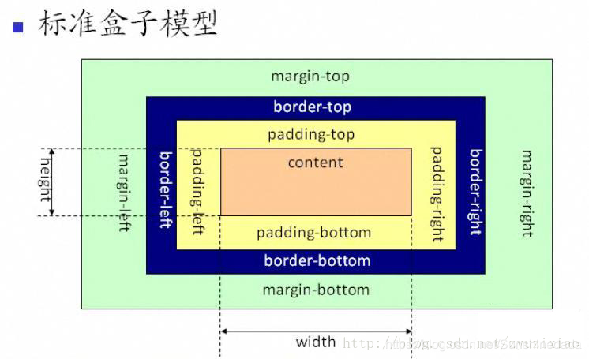

## css 盒子模型

css 盒子模型包含标准模型和 IE 模型

<!-- more -->

### 标准模型


#### 盒子的组成

一个盒子由外到内可以分成四个部分：margin（外边距）、border（边框）、padding（内边距）、content（内容）。会发现 margin、border、padding 是 CSS 属性，因此可以通过这三个属性来控制盒子的这三个部分。而 content 则是 HTML 元素的内容。

#### 盒子的大小

```
盒子的宽度 = width + padding-left + padding-right + border-left + border-right + margin-left + margin-right

盒子的高度 = height + padding-top + padding-bottom + border-top + border-bottom + margin-top + margin-bottom
```

### IE 模型


### 用 css 如何设置两种模型

标准模型：box-sizing:content-box
ie 模型：box-sizing:border-box

### JS 获取盒子模型的宽高

```
dom.style.width/height(只能获取内嵌)
dom.currentStyle.width/height（只有IE支持）
window.getComputedStyle(dom).width/height(火狐谷歌)
dom.getBoundClientRect().width/height (获取展示dom的位置的方法)
```

### 边距重叠

#### 父子元素边距重叠

```html
<!DOCTYPE html>
<html>
	<head>
		<meta charset="utf-8" />
		<title>css盒子模型</title>
		<style media="screen">
			html * {
				margin: 0;
				padding: 0;
			}
		</style>
	</head>

	<body>
		<section id="sec">
			<style media="screen">
				#sec {
					background: #f00;
					/* overflow: hidden; */
				}
				.child {
					height: 100px;
					margin-top: 10px;
					background: yellow;
				}
			</style>
			<article class="child"></article>
		</section>
	</body>
</html>
```
